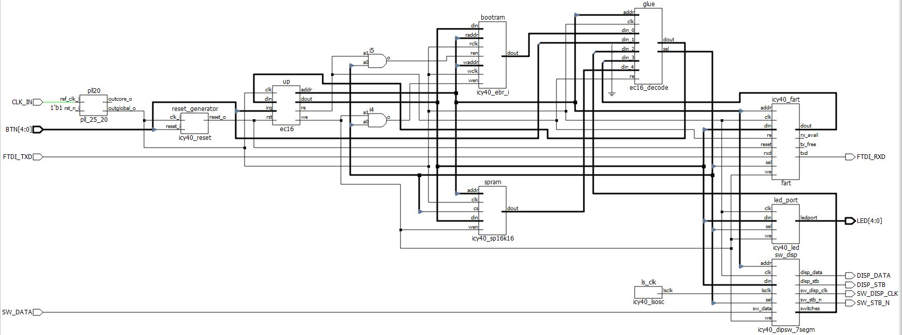

# EC16_on_ICE
EC16 softcore CPU running ECMON @ 20MHz on an ICE40UP5K-SG48 (ICY40-Board)

* Complete Lattice Radiant project (2023.1.1.200.1 ) with VHDL sources
  * EC16 CPU
  * ICY40 board specific top entity
  * FART (Fixed Asynchronous Receiver Transmitter, 115.200 baud, 8-N-1)

* Device utilization (less than 20% of the ICE40UP5Ks logic resources):
  
  * SLICE (est.)     500/2640       19% used
    * LUT            939/5280         18% used
    * REG            257/5280          5% used
  * LFOSC              1/1           100% used
  * SRAM               1/4            25% used
  * EBR                3/30           10% used
  * PLL                1/1           100% used
   

## The EC16 CPU
is word oriented, i.e both data and address bus are 16 bit wide. There are two completely separate memory spaces, the 64K x 16 bit external memory space (EXTMEM) and a small but faster accessible 256 x 16 bit internal memory (INTMEM). 

While the EXTMEM space can be populated as required with on-chip ram, rom and I/O devices, the INTMEM space is fully populated with an EBRam and can be used as registers, pointers to INTMEM or EXTMEM locations, scratchpad ram or stack space.

The EC16 has four maskable prioritized interrupt inputs. 

It has 49 instructions, 45 of which use only 1 word of program memory while the other 4 use two words. 
Thanks to the instruction prefetch the execution speed is rather high
  * 17 instructions execute in 1 clock cycle
  * 15 instructions execute in 2 clock cycles
  * 9 instructions execute in 3 clock cycles
  * 8 instructions (branch) execute in 1 resp. 2 clock cycles (no branch / branch)

See the CPUs manual 

## ECMON monitor program 
written in EC16 assembler. Display and edit content of INTMEM and EXTMEM, upload and start execution of user programs. 

Included is the assembler ec16asm.py 

## The ICY40 top entity 
adds the following components to the EC16

memory map (base addresses)
  * 0x0000 .. 0x1FFF
    * (r/w) EBR boot rom (512 words, preloaded with ECMON)
  * 0x2000 .. 0x3FFF
	   * (r) Buttons PB3..PB0 (PB4 is used as reset)
	   * (w) LEDs L4..L0
  * 0x4000 .. 0x5FFF
    * via external shift registers and FSM (icy40_dipsw_7segm.vhd)
	     * (r) DIP-switches S7..S0
	     * (w) 7-Segment digits & decimal points
  * 0x6000 .. 0x7FFF
    * (r/w) FART Rx/Tx
    * (r)   FART status
  * 0x8000 .. 0xBFFF
	   * (r/w) SPRAM (16kWords)

The design was first developed with logisim-evolution and then transferred to VHDL. The following screen shot gives an idea of the CPUs structure

